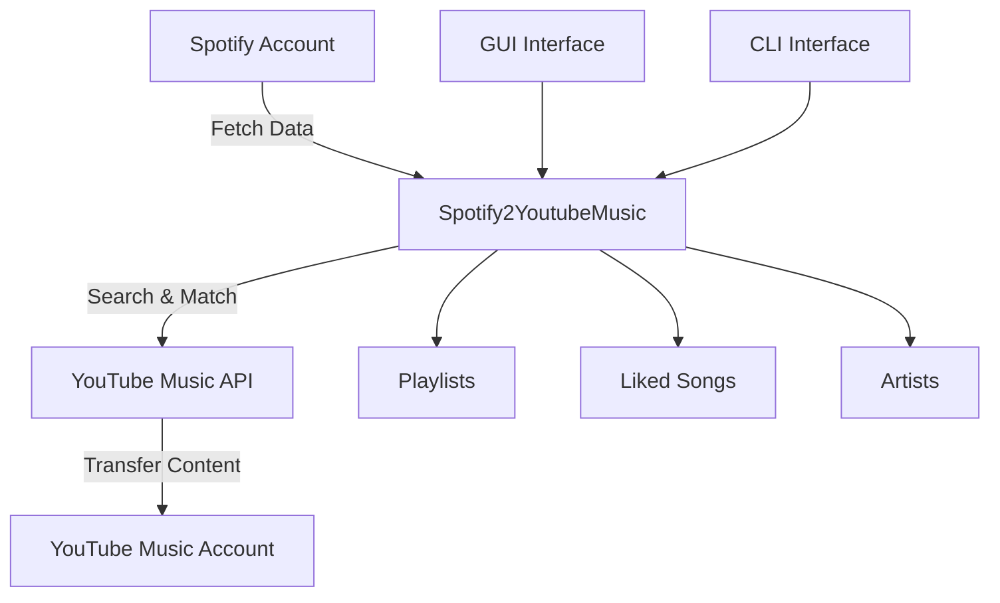

# Spotify ➡️ YouTube Music Playlist Copier


---

```
_________              __  .__  _____       ________ _____.___.              __       ___.             _____               .__        
 /   _____/_____   _____/  |_|__|/ ____\__.__.\_____  \\__  |   | ____  __ ___/  |_ __ _\_ |__   ____   /     \  __ __  _____|__| ____  
 \_____  \\____ \ /  _ \   __\  \   __<   |  | /  ____/ /   |   |/  _ \|  |  \   __\  |  \ __ \_/ __ \ /  \ /  \|  |  \/  ___/  |/ ___\ 
 /        \  |_> >  <_> )  | |  ||  |  \___  |/       \ \____   (  <_> )  |  /|  | |  |  / \_\ \  ___//    Y    \  |  /\___ \|  \  \___ 
/_______  /   __/ \____/|__| |__||__|  / ____|\_______ \/ ______|\____/|____/ |__| |____/|___  /\___  >____|__  /____//____  >__|\___  >
        \/|__|                         \/             \/\/                                   \/     \/        \/           \/        \/ 
```

---

## Table of Contents

1. [Introduction](#introduction)
2. [Features](#features)
3. [Requirements](#requirements)
4. [Installation](#installation)
5. [Usage](#usage)
6. [User Interface](#user-interface)
7. [Troubleshooting](#troubleshooting)
8. [Acknowledgments](#acknowledgments)
9. [License](#license)

---

## Introduction

**Spotify2YoutubeMusic** is a powerful Python tool that seamlessly transfers your music library from Spotify to YouTube Music. It features both a modern graphical interface and a command-line interface, making it easy to copy playlists, liked songs, and followed artists between platforms.

---

## Features

- **Playlist Transfer** - Copy individual or all playlists from Spotify to YouTube Music
- **Liked Songs Import** - Transfer all your Spotify liked songs to a dedicated playlist
- **Artist Following** - Subscribe to your followed Spotify artists on YouTube Music
- **Smart Duplicate Prevention** - Automatically detects existing playlists and only adds new songs
- **Incremental Updates** - Run multiple times without creating duplicates
- **Real-time Progress Tracking** - Visual progress bars and detailed status updates
- **Modern GUI Interface** - Beautiful, dark-themed graphical user interface
- **Command Line Support** - Traditional CLI interface for advanced users
- **Batch Processing** - Efficient handling of large music libraries
- **Error Handling** - Robust retry logic and comprehensive error reporting
- **Cross-platform** - Works on Windows, Linux, and macOS

---

## Requirements

- **Python 3.8+**
- **Spotify API Credentials** (Client ID & Secret)
- **YouTube Music Browser Headers** (for authentication)
- **Internet Connection** (for API access)

### Required Python Packages:
- `spotipy` - Spotify Web API wrapper
- `ytmusicapi` - YouTube Music API wrapper
- `tqdm` - Progress bars
- `tkinter` - GUI framework (usually included with Python)

---

## Installation

### 1. Clone the Repository

```bash
git clone https://github.com/mahdi-y/Spotify2YoutubeMusic.git
cd Spotify2YoutubeMusic
```

### 2. Set Up Virtual Environment (Recommended)

#### Windows:
```bash
python -m venv .venv
.venv\Scripts\activate
pip install -r requirements.txt
```

#### Linux/macOS:
```bash
python -m venv .venv
source .venv/bin/activate
pip install -r requirements.txt
```

### 3. Install Dependencies

```bash
pip install spotipy ytmusicapi tqdm
```

---

## Usage

### Quick Start

1. **Get Spotify API Credentials**
2. **Extract YouTube Music Headers**
3. **Run the Application**

### 1. Generate Spotify Credentials

1. Go to [Spotify Developer Dashboard](https://developer.spotify.com/dashboard/)
2. Create a new app
3. Note your **Client ID** and **Client Secret**
4. Set **Redirect URI** to: `http://127.0.0.1:8888/callback`
5. Update `copy_playlists.py`:
   ```python
   SPOTIFY_CLIENT_ID = 'your-client-id-here'
   SPOTIFY_CLIENT_SECRET = 'your-client-secret-here'
   ```

### 2. Generate YouTube Music Headers

1. Open **Firefox** and navigate to [YouTube Music](https://music.youtube.com)
2. Log in to your account
3. Press **F12** to open Developer Tools
4. Go to **Network** tab
5. Click **Library** in YouTube Music
6. Filter by `/browse` and find a **POST** request
7. Right-click → Copy → Copy Request Headers
8. Save headers to `raw_headers.txt` in the project folder

### 3. Run the Application

#### Graphical Interface (Recommended):
```bash
python ui.py
```

#### Command Line Interface:
```bash
python copy_playlists.py
```

---

## User Interface

### Modern GUI Features

- **Dark Theme** - Easy on the eyes with modern styling
- **Tabbed Interface** - Organized sections for different transfer types
- **Real-time Progress** - Live progress bars and status updates
- **Output Logging** - Detailed transfer logs with clear indicators
- **Playlist Selection** - Choose specific playlists or transfer all at once

### Playlists Tab
- Load and view all your Spotify playlists
- Select multiple playlists for transfer
- One-click "Copy All" functionality
- Real-time search progress with track names

### Liked Songs Tab
- Transfer all liked songs to YouTube Music
- Creates a dedicated "Liked Songs from Spotify" playlist
- Handles large libraries efficiently

### Artists Tab
- Subscribe to followed Spotify artists
- Batch processing for multiple artists
- Automatic matching and subscription

---

## Visual Workflow



---

## Advanced Features

### Smart Duplicate Handling
- Automatically detects existing playlists
- Only adds new songs to prevent duplicates
- Preserves existing playlist structure

### Progress Tracking
- Real-time progress bars
- Detailed status messages
- Track-by-track search updates
- Comprehensive error reporting

### Error Recovery
- Automatic retry for failed requests
- Rate limit handling
- Network timeout protection
- Detailed error logging

---

## Troubleshooting

### Common Issues

**Authentication Problems**
- **Spotify**: Verify Client ID, Secret, and Redirect URI
- **YouTube Music**: Re-extract headers if they expire (usually 1-2 weeks)

**Missing Tracks**
- Some tracks may not be available on YouTube Music
- Alternative versions might be found instead
- Check the output log for details

**Rate Limiting**
- Built-in retry logic handles most cases
- Wait a few minutes if persistent issues occur
- Consider reducing batch sizes for large libraries

**UI Issues**
- Ensure Python has tkinter support
- Update to latest Python version if needed
- Run `python -m tkinter` to test GUI support

### Getting Help

1. Check the output log for detailed error messages
2. Verify your API credentials are correct
3. Ensure stable internet connection
4. Try the CLI version if GUI issues persist

---

## File Structure

```
Spotify2YoutubeMusic/
├── copy_playlists.py      # Main script with CLI interface
├── ui.py                  # Modern GUI application
├── raw_headers.txt        # YouTube Music headers (you create this)
├── browser.json          # Generated YTMusic config
├── requirements.txt       # Python dependencies
├── README.md             # This file
└── LICENSE               # MIT License
```

---

## Contributing

We welcome contributions! Please feel free to:
- Report bugs and issues
- Suggest new features
- Submit pull requests
- Improve documentation

---

## Acknowledgments

- **[sigma67](https://github.com/sigma67/ytmusicapi)** - Creator of ytmusicapi
- **[Spotipy Team](https://spotipy.readthedocs.io/)** - Spotify Web API wrapper
- **Community Contributors** - Bug reports and feature suggestions

---

## License

This project is licensed under the [MIT License](LICENSE).

```
MIT License - Feel free to use, modify, and distribute
See LICENSE file for full details
```

---

## Disclaimer

This tool is for personal use only. Please respect the terms of service of both Spotify and YouTube Music. The developers are not responsible for any violations of these services' terms of use.

---

<div align="center">

### **Enjoy Your Music Everywhere!**

*Transfer your music library seamlessly between platforms*

</div>

