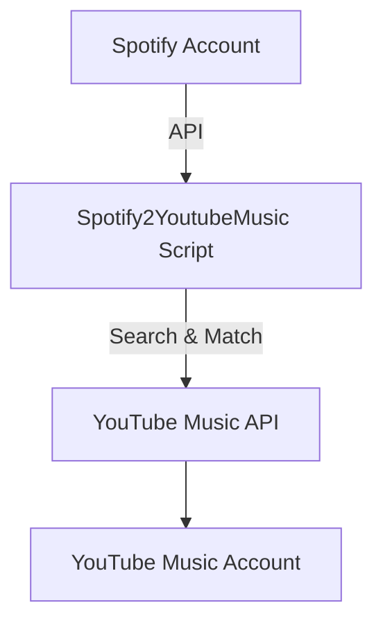

# Spotify YouTube Music Playlist Copier


---

```
_________              __  .__  _____       ________ _____.___.              __       ___.             _____               .__        
 /   _____/_____   _____/  |_|__|/ ____\__.__.\_____  \\__  |   | ____  __ ___/  |_ __ _\_ |__   ____   /     \  __ __  _____|__| ____  
 \_____  \\____ \ /  _ \   __\  \   __<   |  | /  ____/ /   |   |/  _ \|  |  \   __\  |  \ __ \_/ __ \ /  \ /  \|  |  \/  ___/  |/ ___\ 
 /        \  |_> >  <_> )  | |  ||  |  \___  |/       \ \____   (  <_> )  |  /|  | |  |  / \_\ \  ___//    Y    \  |  /\___ \|  \  \___ 
/_______  /   __/ \____/|__| |__||__|  / ____|\_______ \/ ______|\____/|____/ |__| |____/|___  /\___  >____|__  /____//____  >__|\___  >
        \/|__|                         \/             \/\/                                   \/     \/        \/           \/        \/ 
```

---

## Table of Contents

1. [Introduction](#introduction)
2. [Features](#features)
3. [Requirements](#requirements)
4. [Installation](#installation)
5. [Usage](#usage)
6. [Troubleshooting](#troubleshooting)
7. [Acknowledgments](#acknowledgments)
8. [License](#license)

---

## Introduction

**Spotify2YoutubeMusic** is a Python tool that copies your playlists, liked songs, and followed artists from Spotify to YouTube Music. It automates the process of searching for each track or artist on YouTube Music and recreates your music library there.

---

## Features

- **Batch import** your Spotify playlists
- **Import all playlists** at once or select specific ones (with range support)
- **Import Liked Songs** from Spotify
- **Import Followed Artists** from Spotify
- **Progress bar** for track processing
- **Error handling** and retry logic for robust transfers

---

## Requirements

- Python 3.8+
- Spotify API credentials (Client ID & Secret)
- YouTube Music authentication headers (from your browser)
- Command Prompt (Windows) or Terminal (Linux/macOS)
- [ytmusicapi](https://github.com/sigma67/ytmusicapi) and [spotipy](https://spotipy.readthedocs.io/)

---

## Installation

### 1. Clone the Repository

```sh
git clone https://github.com/mahdi-y/Spotify2YoutubeMusic.git
cd Spotify2YoutubeMusic
```

### 2. Set Up a Virtual Environment (Recommended)

#### For Linux/macOS:

```sh
python -m venv .venv
source .venv/bin/activate
pip install -r requirements.txt
```

#### For Windows:

```sh
python -m venv .venv
.venv\Scripts\activate
pip install -r requirements.txt
```

---

## Usage

### 1. Generate Spotify Credentials

- Go to the [Spotify Developer Dashboard](https://developer.spotify.com/dashboard/).
- Create an app and obtain your **Client ID** and **Client Secret**.
- Set the **Redirect URI** to `http://127.0.0.1:8888/callback`.
- Enable **Web API** access.
- Open `copy_playlists.py` and replace:
  ```python
  SPOTIFY_CLIENT_ID = 'Your-Spotify-Client-ID'
  SPOTIFY_CLIENT_SECRET = 'Your-Spotify-Client-Secret'
  ```

### 2. Generate YouTube Music Credentials

- Open YouTube Music in **Firefox** and log in.
- Press **F12** (or right-click → Inspect) to open Developer Tools.
- Go to the **Network** tab and reload the page.
- Click on **Library** in YouTube Music.
- Filter requests by `/browse` and select a **POST** request with **Status 200**.
- In **Request Headers**, click **RAW** and copy all headers.
- Paste them into a file named `raw_headers.txt` in your project directory.

### 3. Run the Script

```sh
python copy_playlists.py
```

- Follow the on-screen prompts to select what you want to copy:
  - Playlists (all or selected)
  - Liked Songs
  - Followed Artists

---

## Visual Workflow



---

## Troubleshooting

- **Invalid YouTube Music credentials?**  
  Credentials may expire. Regenerate them by repeating the steps in [Generate YouTube Music Credentials](#2-generate-youtube-music-credentials).

- **Missing tracks?**  
  Some tracks may not be available on YouTube Music or may have different metadata.

---

## Acknowledgments

- Thanks to [Sigma67](https://github.com/sigma67/ytmusicapi) for `ytmusicapi`.
- Thanks to [Spotipy](https://spotipy.readthedocs.io/) for Spotify API access.

---

## License

This project is licensed under the [MIT License](LICENSE).

---

> **Enjoy your music everywhere!**

